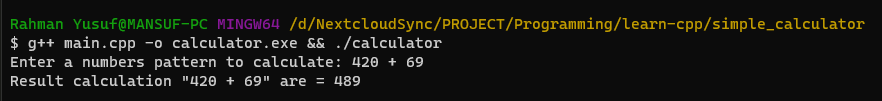

# simple-calculator-cpp

Simple calculator in cpp

## How ?

Take pattern numbers (ex: `69 + 420`) and then calculate it.

## Notes

It will only works for 2 numbers calculation. If more than that, it will throw an error (because it's unsupported).

## Usage

In this case i'm using MinGW, i don't know if it works for Microsoft cpp compiler.

```shell
# Clone the repository first
git clone https://github.com/mansuf/simple-calculator-cpp.git
cd simple-calculator-cpp

# Compile the app
g++ main.cpp -o calculator.exe

# Run the app
./calculator.exe
```

## Example output


